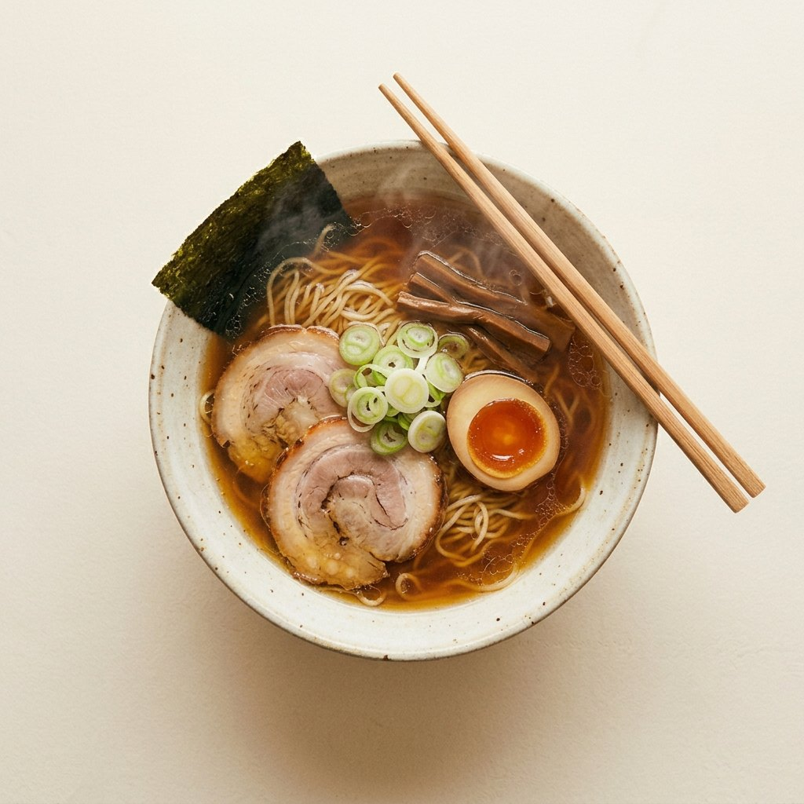

# Ramen — a three-page minimal site

A small static site about ramen, in English, three pages sharing one minimalist style.

| Page | File | Content |
| --- | --- | --- |
| Home | `index.html` | A full-bleed banner, a short introduction, and three photographic doors into the pages below. |
| Story | `story.html` | A short history of ramen: arrival from China, the postwar yatai years, instant noodles, a timeline, the anatomy of a bowl, regional styles. |
| Recipe | `recipe.html` | Tokyo-style shoyu ramen for two: ingredient lists, eight steps, notes. |
| Places | `places.html` | Five well-known ramen places — two in Tel Aviv, three in Japan — plus counter etiquette. |

The masthead links home; the three navigation items are the sub-pages.

Plain HTML, two stylesheets and one small script for the theme switch. No
build step, no dependencies: open `index.html` in a browser, or serve the
folder with anything (`npx http-server .`).

## Style

The design direction is recorded in `.impeccable.md`; the short version:

- **Type** — Shippori Mincho for display, Zen Kaku Gothic New for text. Both
  are contemporary Japanese faces whose Latin reads warm and precise, which
  suits the subject better than another editorial serif.
- **Scale** — three text sizes and two display steps, and nothing else, so the
  three pages share one hierarchy: 19px for leads, item headings and every
  accent numeral; 17px for all running text; 13px for notes, captions and
  uppercase labels. Years, step numbers and place numbers are a single rule —
  same face, size, weight and colour wherever they appear.
- **Colour** — four colours, in OKLCH: `#2f2519` and `#4a3f35` (the browns of
  a dark counter) and `#fa7d09` and `#ff4301` (two oranges). The dark theme is
  those four almost literally — browns as ground and surface, oranges as
  accent and ornament. The light theme borrows the browns as its ink, which is
  where its contrast comes from, and keeps the oranges for accents over a
  near-white. The footer differs by theme on purpose: a hairline and the page
  in the light one, a band of the second brown in the dark one. Every text
  pair on every page clears 4.5:1 in both themes; body text runs 13–14.5:1.
- **Space** — a 4pt scale with semantic names, fluid section rhythm, body
  measure capped at 66ch.
- **Print devices** — hairline rules, dotted menu leaders in the ingredient
  lists, numbered steps and places, one raised initial per page, a timeline
  split into two eras on parallel hairline axes, and a method split into two
  phases with each step's clock out in the right margin.
- Responsive to phone width, dark theme via `prefers-color-scheme` plus a
  switch, one staggered reveal on load that respects `prefers-reduced-motion`.

## Theme

The stylesheet carries both palettes and follows the system by default. The
switch in the masthead — an ajitama, drawn in line for the light theme and
filled for the dark one — writes `data-theme` on `<html>` and remembers the
choice in `localStorage` under `ramen-theme`; until someone picks a side, the
page keeps following the system, including a change made while it is open.

`theme.js` is loaded synchronously in `<head>` on purpose. The stored theme
has to be on the element before the first paint, or the page flashes the wrong
palette; a deferred script would do exactly that. It is a few hundred bytes,
local, and every `localStorage` access is wrapped, since private windows throw
rather than return null.

## Fonts

`fonts.css` carries both families as Latin-only subsets embedded as data URIs:
no third-party requests, and the type still renders when a page is opened
straight from disk (Chrome refuses font files over `file://` as cross-origin).

The woff2 sources live in `fonts/`. To rebuild the stylesheet after changing
them:

```sh
python3 tools/build-fonts.py
```

## Images

Eight photographs in `images/`, each served as WebP with a JPEG fallback:

```html
<picture>
  <source srcset="images/01-hero-bowl.webp" type="image/webp">
  
</picture>
```

Heroes carry `fetchpriority="high"`, everything below the fold is
`loading="lazy"`. Formats follow the position: heroes square or 3:2, in-body
figures 3:2, the wide band on the Places page 2:1. The home banner is full-bleed,
cropped from its right edge so a narrow window never cuts the subject.
Together they weigh about 660 KB as WebP.

`images/bowl-top.svg` is the one drawing left in the repo — it is the
browser-tab icon, which needs to stay vector. The other illustrations were
replaced by the photographs and remain in git history.

`IMAGE-PROMPTS.md` holds the prompts the photographs were generated from, so a
replacement can be matched to the same set. Prompt 8 is image-to-image: it
takes a photograph of you holding a bowl and rebuilds it as the banner.

The banner comes in two treatments, because the type has to hold against
whatever photograph sits behind it. A dark picture is the default: pale scrim,
near-white type. For a light one, add the modifier —
`<section class="banner is-light">` — and it flips to a pale scrim with dark
type. Both use fixed values rather than theme tokens, since the photograph
does not change with the colour scheme.

To use real photographs instead, drop them in `images/` and change the `src` on
the relevant ``: the layout sizes images by their container, so a landscape
JPEG works in place of the wide SVGs (`yatai`, `bowl-side`, `ingredients`,
`pot`, `noren`) and a square one in place of `bowl-top.svg`. Keep the `alt` text
or write new text describing the photo.

| File | Used on | Subject |
| --- | --- | --- |
| `bowl-top.svg` | Story (hero), favicon | A bowl seen from above |
| `yatai.svg` | Story | A mobile ramen cart at night |
| `bowl-side.svg` | Story | Steaming bowl, chopsticks lifting noodles |
| `ingredients.svg` | Recipe (hero) | Ingredient flat-lay |
| `pot.svg` | Recipe | Simmering stockpot, ladle, tare |
| `noren.svg` | Places (hero) | Shop front with noren curtain |
| `map.svg` | Places | Israel and Japan |
